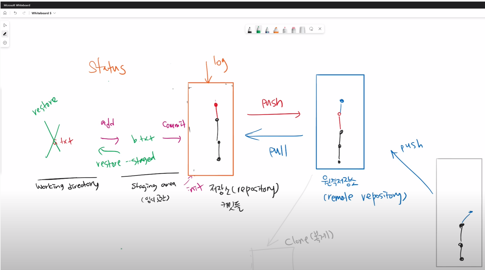

|         | pull        | clone  |
| ------- | ----------- | ------ |
| 무엇을? | 변경된 커밋 | 저장소 |
|         |             |        |
|         |             |        |

- 팀 프로젝트를 시작할 때, 

GIthub (초대 받아서)

조장 | 저장소 만들어요(로컬) `git init` > push Github (원격 저장소)

조원 | Github 에서 한 번 `git clone` 후 이 후 `git push` 와 `git pull` (커밋들만 업데이트)


1. TIL 정리 자유롭게 정리하고 커밋하고 push 
2. 처음부터 원격 저장소 push까지 흐름 연습

```bash
#로컬
git init
git add .
git commit -m 
git status
git log

#원격
git push origin master
git pull origin master
git remote add origin
git clone {URL}
```


`git status`

- 현재 디렉토리 중 > 변경된 파일들만

## Git Flow

Git을 활용하여 협업하는 흐름으로 branch를 활용하는 전략을 의미한다.

가장 대표적으로 활용되는 전략은 다음과 같다.


## 상황 1

1. 혼자 작업, 조원 프리라이딩 (Fast-foward)
   - 홈 화면을 만든다. (home.txt)
   - `git branch feature/home`
   - `git checkout feature/home`
   - 

## 상황 2

1. 각자 커밋이 발생했는데, 다른 파일만 수정된 경우


## github 활용

`git merge feature-a`

Branch merge


Branch merge - --no f

같은 파일 수정 >> 충돌 해결 

같은 파일 수정 X >  자동으로 해결

## github flow의 기본 원칙


Github Flow는 Github에서 제안하는 브랜치 전략으로 다음과 같은 기본 원칙을 가지고 있다.

1.


4. pull request

1. Feature Branch Workflow

   - shared repository model

   2. foking Workflow
      - Fork and Pull model 


```bas
$ git checkout -b hotfix


git add .

git commit -m 'readme hotfix'

git push origin hotfix

branch -d 삭제
checkout -b 브랜치를 만들며 이동

pull request - hotfix 브랜치를 마스터 에게 요청 ?

create pull request 누르고 
```


로컬A > `git push origin a`  > 원격 `pull request` master에 합쳐주세요

왜 이렇게 할까요? 

로컬B 라는 사람이 있음 `git push origin b`  `pull request` 

Merge 작업을 원격 저장소인 깃헙에서

해당 프로젝트에서 브랜치를 만들어 작업을 하고 푸시를 한 후 full request 를 해서 작업을 함


조장은 보통 가장 잘하는 사람이 함 pull request 리뷰 ? 

개발 프로젝트를 할 때, 조장인 사람은 제일 잘해서 조장이라고 생각해야함 ? 


마지막 실습은 fork 를 해서 


fork & Pull Request


kdt-live 의 저장소긴 한데, fork 가 되었다.

작업하실 때는, 어떠한 형식으로 가져가냐면 

편집을 어떤식으로 접근을 하면 좋을까요 ? 

> git clone 을 한 후 local 에서 ? 
>
> 저장소를 복제하고, `git clone {url}`
>
> origin 은 kdt-live 의 것이었습니다


`git restore` | 변경사항을 버리고 싶으면  | restore 는 되돌릴 수 없음

### 왜 커밋이 중요할까요?

하나의 버전을 만드는 건데, 버전이라고 하는 게 결국에는 어떤 소프트웨어 상태인데,

그 소프트웨어 상태를 기록을 해두는 것. 막 예를 들면 이런 일들이 있음

어떤 일들이 있냐면, 코드를 작성해요 막 새로운 기능을 6시간동안 다양한 블로그를 코드 붙여놔요 


=> 기존에 되던 것도 안됨..

=> 보통 어떤 결정을 하냐면.. 옛날로 돌아가야함 6시간 전으로 

=> 블로그 코드가 없었던 상황

=> 근데 더 파국으로 가요. 아니면 어느시점 이후로 못 가요.

=> 그리고 울어요.


커밋을 잘 해두었다면. 커밋을 했는데, 안되네 ?

바로 리스토어 ~ 

정리 하자면 ~ 메세지 잘 읽자 ~ 앞으로 나아가자 


working directory staging area(임시공간)





1. 모든변경사항은 로컬에서 하고 (깃헙에서 하면 편한데, 이해를 해야해서)

   커밋하고  push

   2.gitignore

